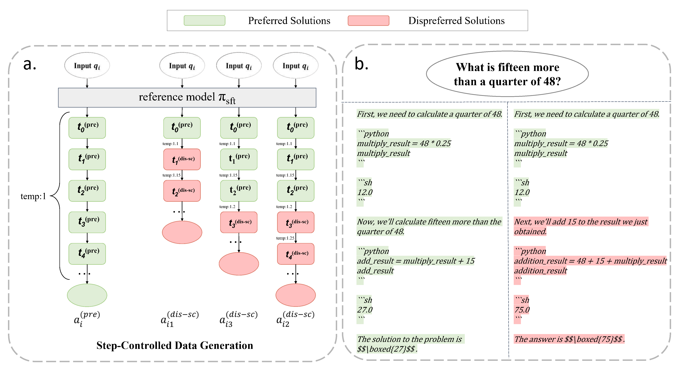

# Step-Controlled DPO

This is a repository for the paper: Step-Controlled DPO: Leveraging Stepwise Error for Enhanced Mathematical Reasoning.

The paper is at `paper/SCDPO.pdf`.

<p align="center">
  
</p>

### Models

| Model | Checkpoint | GSM8k | MATH  |
| ----- |------| ---- |-------|
| MathGenie/InternLM2-SFT-SCDPO | 🤗 <a href="https://huggingface.co/MathGenie/InternLM2-SFT-SCDPO" target="_blank">HF Link</a>| **88.5**  |  **58.1**	|
| MathGenie/Mistral-7B-Ours-SFT | 🤗 <a href="https://huggingface.co/MathGenie/Mistral-7B-Ours-SFT" target="_blank">HF Link</a>| **76.8**  |  **43.2**	|
| MathGenie/Mistral-7B-Ours-SFT-SCDPO | 🤗 <a href="https://huggingface.co/MathGenie/Mistral-7B-Ours-SFT-SCDPO" target="_blank">HF Link</a>| **80.1**  |  **47.7**	|

### Datasets

| Dataset | Link |
| ----- |------|
| MathGenie/SCDPO-Data-Mistral-Ours | 🤗 <a href="https://huggingface.co/datasets/MathGenie/SCDPO-Data-Mistral-Ours" target="_blank">HF Link</a>| 

### DPO and SCDPO Data Generation

The code for DPO and SCDPO data generation is in `src`. `src/positive_negative_lce_gen`, `src/positive_negative_lce_gen_internlm_ape` and `src/positive_negative_lce_gen_mathcode_mistral_addsys` are for the generation of DPO data, while `src/step_controled_dpo_lce_internlm`, `src/step_controled_dpo_lce_mathcoder` and `src/step_controled_dpo_lce` are for the generation of SCDPO data.

API inference of internlm models are deployed using vllm, with an example script at `src/positive_negative_lce_gen_internlm_ape/scripts_1/deploy_vllm.sh`. Other models are deployed using an image from [huggingface/text-generation-inference](https://github.com/huggingface/text-generation-inference), with an exampe deploy script at `src/deploy-tgi.sh`

### SFT, DPO, and SCDPO Training

The training code is based on the repository [huggingface/alignment-handbook](https://github.com/huggingface/alignment-handbook). The code for SFT training is at `alignment-handbook/scripts/run_sft_lce.py`, which is adapted for code-integrated training. The code for DPO and SCDPO training is at `alignment-handbook/scripts/run_dpo.py`. The config yaml files and training shell scripts are at `alignment-handbook/recipes`. You can modify the paths in the `.yaml` files and `.sh` files to train the models.

### Inference

The inference code is at `alignment-hendbook/src/inference`. `inference_g.py`, `inference_m1.py` and `inference_m2.py` are for generating the solutions. `compute_acc.py` is for computing the accuracy of the generated solutions.

Install the inference environment:

```
pip install -r alignment-hendbook/src/inference/requirements.txt
```

Use huggingface tgi from https://github.com/huggingface/text-generation-inference. Deploy the model using `deploy.sh`

For example:
```
bash alignment-hendbook/src/inference/mistral-7b-lce/deploy.sh MODEL_PATH
```

Then put the model name in `config.json` to specify the directory name the inference results are saved into. Start inference by running `infer.sh`

For example:
```
bash alignment-hendbook/src/inference/mistral-7b-lce/infer.sh g 3epoch

bash alignment-hendbook/src/inference/mistral-7b-lce/infer.sh m1 3epoch

bash alignment-hendbook/src/inference/mistral-7b-lce/infer.sh g 3epoch
```

Deviding the inference into three parts is to save time. `3epoch` is to clarify the checkpoint, you can replace it with your own name such as `2epoch`, `500step`, ect.

Finally, after the inference has finished, compute accuracy using `compute_acc.py`. For example:

```
bash alignment-hendbook/src/inference/mistral-7b-lce/compute_acc.py 3epoch
```

